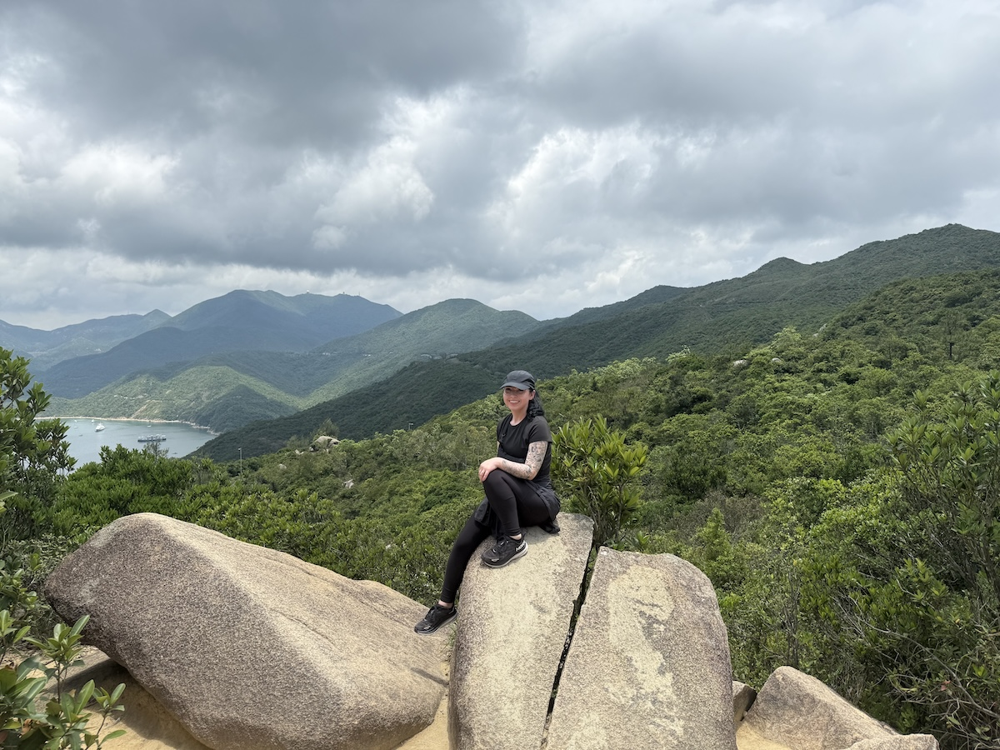

# Name: Breanna Tewksbury (she/her)


# 1. Programming Experience


-   No programming experience (less than beginner)


# 2. Course Goals


1.  Understand R Syntax

2.  Become more confident in programming

3.  Be able to apply what I've learned in future classes and projects

# 3. Favorite equation


@eq-fav is the Lotka-Volterra competition model for understanding the effect of species 2 on species 1 ($\frac{d \cdot N_1}{d \cdot t} = r_1\cdot N_1 \left(\frac{K_1-N_1-a \cdot N_2}{K_1}\right)$). It actually isn't my favorite equation, but I thought it would be fun to figure out how to correctly write it for this assignment.

$$
\frac{d \cdot N_1}{d \cdot t} = r_1\cdot N_1 \left(\frac{K_1-N_1-a \cdot N_2}{K_1}\right)
$${#eq-fav}



# 4. Favorite flow chart


@fig-chart shows my favorite flow chart.

```{mermaid}
%%| label: fig-chart
%%| fig-cap: Simplified flowchart that shows how carbon is transferred from the short term cycle into the long term cycle.
graph TB
    A[Atmospheric Carbon] -->|Silicate Weathering and CaCO3 Deposition| B[Carbonate in Sediments]
    A --> |Photosynthesis and Organic C Burial| C[Organic C in Sediments]
    B --> |Subduction| D[Mantle]
    C --> |Subduction| D


    
```


# 5. Something fun


@fig-fun is a photo of me that was taken during a hike in Hong Kong. 

```{r}
#| label: fig-fun
#| fig-cap: Me sitting on some rocks at Dragon's Back, Shek O, Hong Kong (May 19th, 2025)
#| echo: FALSE
#| out-width: 100%

```
