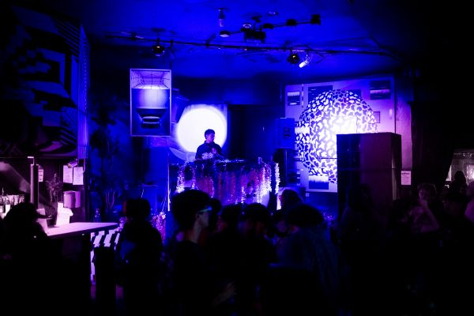

# Name: Douglas (He/Him)

# 1. Languages

-   R (intermediate)

-   No 2nd programming language.

::: callout-note
## Levels

-   beginner = know my way around the language enough to write some basic code
-   intermediate = know a few tricks and can usually figure out how to solve a problem using language help/online resources
-   advanced = can write code fluently without needing to stop for help and am generally aware of the language's best practices
-   expert = understand how the language is structured at a fundamental level and have a very intuitive understanding for efficiently solving any problem I encounter
:::

# 2. Goals

1.  Diversify data visualization tools.

2.  Acclimate to data/programming language infrastructure.

3.  Improve workflow tracking and reproducibility.

# 3. Favorite equation

My favorite equation is a basic sine wave equation because it is fundamental to my favorite music genres and sounds:

$$
y(t) = A\\sin(\\omega t + \\phi)
$$



# 4. Favorite flow chart

@New-and-approved-optometrist-exam shows my best work yet.

```{mermaid}
%%| label: New-and-approved-optometrist-exam
%%| fig-cap: Deciding whether or not you need glasses.
graph LR
   A{Is this a diamond?} -->|No| B((You probably think this is a diamond too))
   B --> D[See Doctor]
   A -->|Yes| C[How about this? Tilt your head.]
   C -->|Yes| E[No glasses needed, but you like to stretch the truth]
   C -->|No| B
```

::: callout-tip
Click on the "Preview" button above the code block to render your chart or use the [Mermaid Live Editor](https://mermaid.live/edit) if you want to see the output immediately.
:::

# 5. Something fun.

@fig-fun shows me playing some nice music.

```{r}
#| label: fig-fun
#| fig-cap: Here I am Djing at The Black Box in Denver, CO on my birthday!
#| echo: FALSE
#| out-width: 100%

```