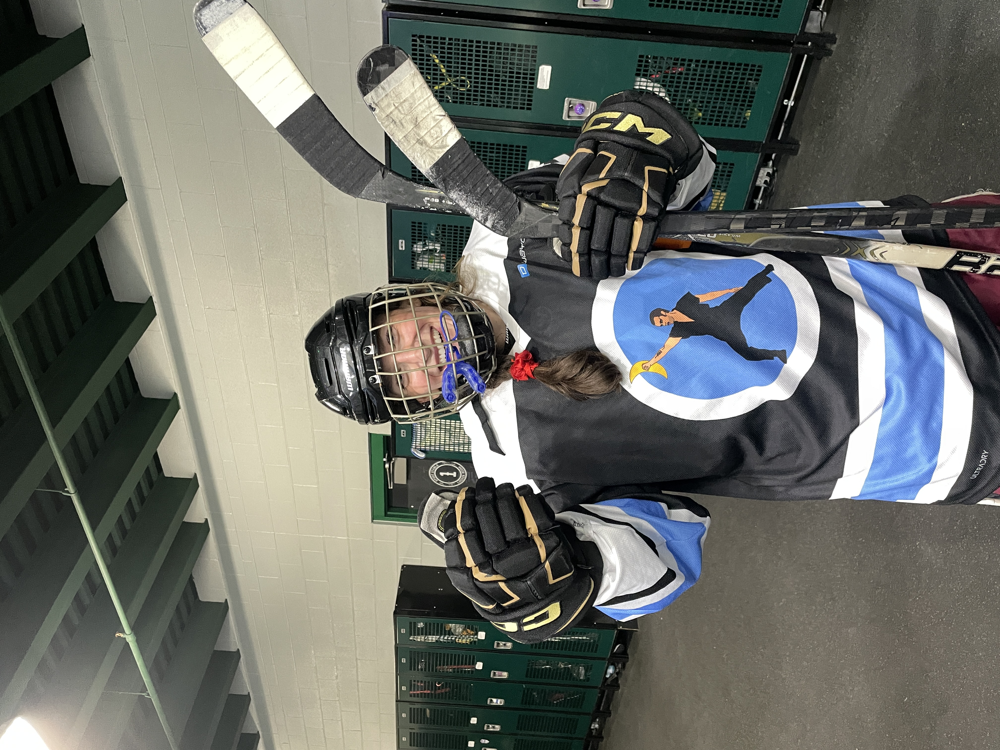

# Name: Haley (she/her)

> Add your name and preferred pronouns in the heading above.

# 1. Programming Experience

> What are the main programming languages (if any) that you currently use and what is your approximate level of mastery? Don't worry if you don't have much programming experience yet! This just helps me understand everyone's background and plan accordingly.

-   R (Rstudio) (beginner; have used it for data processing in CUBES-SIL but not really able to synthesize my own code proficiently. I do have some plots I made in R for my data for our grant, but that was with help from Katie and ChatGPT)

::: callout-note
## Levels

-   beginner = know my way around the language enough to write some basic code
-   intermediate = know a few tricks and can usually figure out how to solve a problem using language help/online resources
-   advanced = can write code fluently without needing to stop for help and am generally aware of the language's best practices
-   expert = understand how the language is structured at a fundamental level and have a very intuitive understanding for efficiently solving any problem I encounter
:::

# 2. Course Goals

> List three goals you would like to accomplish through this class. This can be anything from things you'd like to know, skills you'd like to learn or improve, concepts you'd like to understand or apply, etc.

1.  Primarily, I'd like to develop my R abilities so that I can make publication- and communication-quality figures and plots. 

2.  I would also like to become more proficient in data management in R; I used Excel during my Master's for both data management and plotting so I'm not super comfortable making/adjusting dataframes/tables in R.

3.  I'd like to have a more intuitive understanding of the structure of the R programming language so that when I troubleshoot, I know how/what to find how to fix. 

# 3. Favorite equation

> Tell & show us one of your favorite equations to practice some LaTeX math. It does not have to be a complicated one. Have fun with it.

@eq-fav is the isotope mass balance equation [$\Sigma (\delta_i \cdot m_i) = \delta_a \cdot m_a + \delta_b \cdot m_b + \delta_c \cdot m_c...$], one of my favorite equations in the whole wide world.

$$
\Sigma (\delta_i \cdot m_i) = \delta_a \cdot m_a + \delta_b \cdot m_b + \delta_c \cdot m_c...
$${#eq-fav}



# 4. Favorite flow chart

> Draw a little flowchart to practice this charting feature. It does not have to be complicated. Have fun with it. Don't forget to fill in a figure caption under `fig-cap`. 

@fig-chart shows my favorite flow chart.

```{mermaid}
%%| label: fig-chart
%%| fig-cap: Decision flowchart to figure out whether you should eat the chocolate bar.
graph LR
    A{Should I eat this chocolate bar} -->|No| B(Yes you should)
    A --> |Yes| C[Eat the chocolate!]
    B --> C
```

::: callout-tip
Click on the "Preview" button above the code block to render your chart or use the [Mermaid Live Editor](https://mermaid.live/edit) if you want to see the output immediately.
:::

# 5. Something fun

> Add a picture of yourself doing something you enjoy outside school (hiking, cooking, playing music, reading, etc) to the `images` folder and link to it here with a descriptive caption by changing the `fix-cap` below. Make sure that images are not too big and in **jpeg/jpg** or **png** format. A width of 600 to maximally 1200 pixels is typically plenty large (i.e. less than **\~2Mb**). You can scale your image to these dimensions using any photo editing software. For example, a convenient free online tool for scaling images is available at <http://www.simpleimageresizer.com/>. Lastly, the file names are case-sensitive! So `example.PNG` (upper-case PNG) is not the same as `example.png` (lower-case png), make sure that you have the filename correctly.

@fig-fun is me after a hockey game--I play in a league on Monday nights.

```{r}
#| label: fig-fun
#| fig-cap: Thumbs up for hockey! My team name is "The Icemen Cometh," a reference from It's Always Sunny in Philadelphia. I designed our jerseys!
#| echo: FALSE
#| out-width: 100%

```
