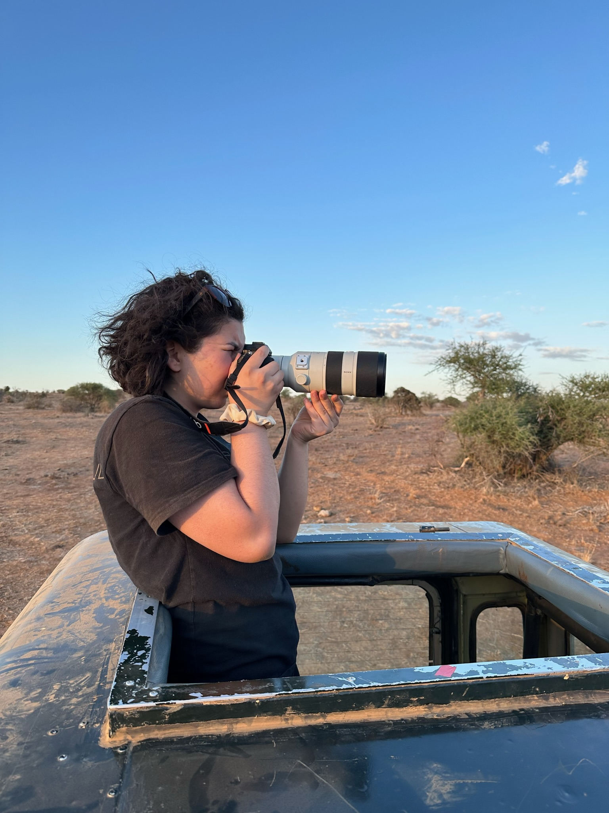
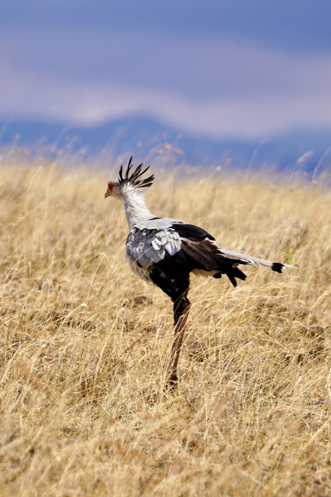

# Name: Nadia Alhassani (he/her/hers)


# 1. Programming Experience

-   Language1: R, intermediate (have taken ~4 classes utilizing R)

-   Language2: C & Python: beginner (have only tried it a couple times in a previous class)


# 2. Course Goals

1.  Get better with data tidying! I spend a lot of time on excel trying to tidy but I know there are better & faster ways with R.

2.  Get more comfortable writing in R. I don't want to stop to look up syntax & example code for every analysis/visualization I do.

3.  Learn the skills to make publishable graphs! Feel comfortable with various styles, techniques, and packages for graphs.

# 3. Favorite equation

@eq-fav are the lotka-volterra equations, modeling prey (x)and predator (y) populations over time (t). $\alpha$ is the natural growth rate of prey in the absence of predators, $\beta$ is the predation rate coefficient, $\gamma$ is the natural death rate of predators in the absence of prey, and $\delta$ is the reproduction rate of predators per prey eaten 

$$
\begin{cases}
\frac{dx}{dt} = \alpha x - \beta xy \\
\frac{dy}{dt} = \delta xy - \gamma y
\end{cases}
$${#eq-fav}



# 4. Favorite flow chart

@fig-chart shows a flow chart of whether you should get a bird feeder or not...

```{mermaid}
%%| label: fig-chart
%%| fig-cap: flowchart to determine whether you need a bird beeder or not
graph LR
    A[Do you want<br>a bird feeder?] -->|Yes| B{Get a bird feeder}
    A -->|No| C[Do you have<br>a cat?]
    C -->|Yes| B
    C -->|No| D[Do you want<br>happiness in your life?]
    D -->|Yes| B
    D -->|No| E[Too bad...]
    E --> B

```


# 5. Something fun

@fig-fun shows me taking a photo, and the photo I took:

```{r}
#| label: fig-fun
#| fig-cap: Me taking a photo & the photo of the secretary bird I took
#| echo: FALSE
#| out-width: 100%


```
