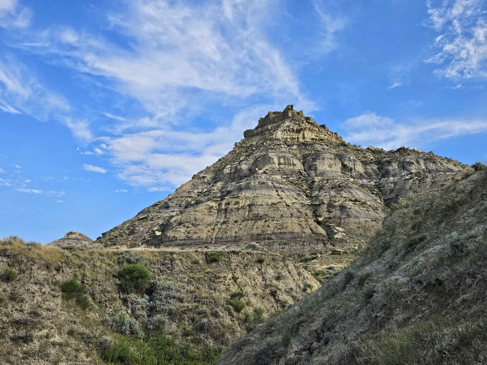

# Name: Robert Bourque

# 1. Programming Experience


-   Java (beginner)

-   R (introductory)

::: callout-note
## Levels

-   beginner = know my way around the language enough to write some basic code
-   intermediate = know a few tricks and can usually figure out how to solve a problem using language help/online resources
-   advanced = can write code fluently without needing to stop for help and am generally aware of the language's best practices
-   expert = understand how the language is structured at a fundamental level and have a very intuitive understanding for efficiently solving any problem I encounter
:::

# 2. Course Goals

1.  Learn how to code to apply within academic work

2.  Learn how to incorporate my own data into figures

3.  Any other fundementals for coding in science.

# 3. Favorite equation

@eq-fav is the ratio of plant wax lipids for assessing if the input is largely derived from terrestrial (low Paq') or aquatic (high Paq') plants. This equation is special as it was a major part of my first publication and masters thesis.

$$
Paq'=(A_{21} + A_{23} + A_{25})/(A_{21} + A_{23} + A_{25} + A_{27} + A_{29} + A_{31})
$${#eq-fav}



# 4. Favorite flow chart

@fig-chart shows my favorite flow chart.

```{mermaid}
%%| label: fig-chart
%%| fig-cap: Testing out the flowchart.
graph LR
    A{Can I make a circular <br> flow chart?} -->|No| B(Try again)
    A --> |Yes| C[Loop back around?]
    B --> C
    C --> D[Back to the start]
    D --> A
```

# 5. Something fun

@fig-fun The field site I went to last summer.

```{r}
#| label: fig-fun
#| fig-cap: Searching for organic molecules in South Dakota.
#| echo: FALSE
#| out-width: 100%

```
