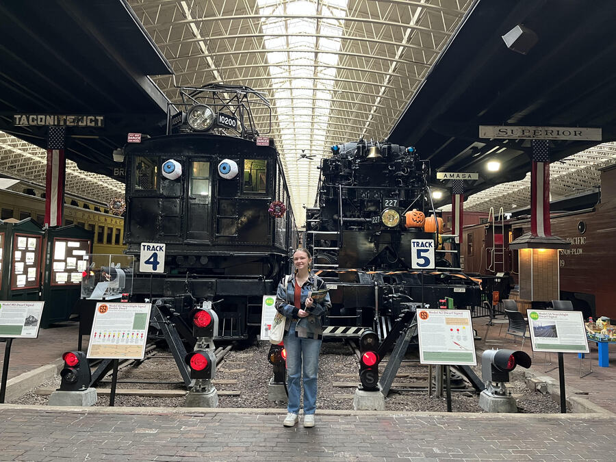

# Name: Sophia Anderson She/Her/Hers

# 1. R, intermediate

-   R, beginner

# 2. Diversify data visualization tools, acclimate to data infrastructure, and improve workflow and reproducibility. 

1.  Confidently produce figures in R

2.  Beccome more comfortable with coding in general

3.  Apply problem-solving skills I use in other areas of my field to coding

# 3. Favorite equation
$$
E = a^2+b^2=c^2
$${#eq-fav}



# 4. Favorite flow chart

```{mermaid}
%%| label: fig-chart
%%| fig-cap: Version control flowchart to figure out of someone is super cool and likes bugs. 
graph LR 
A{{Do you want to hear a fun fact about bugs?}}  -->|No| B((That's too bad))
A --> |Yes| C[/Termite queens can lay around 40,000 eggs a day/]
B --> C
```

# 5. Something fun

```{r}
#| label: Museums and Trains
#| fig-cap: I enjoy visiting museums and research collections. This is me at the train museum located in Duluth, Minnesota.
#| echo: FALSE
#| out-width: 100%

```