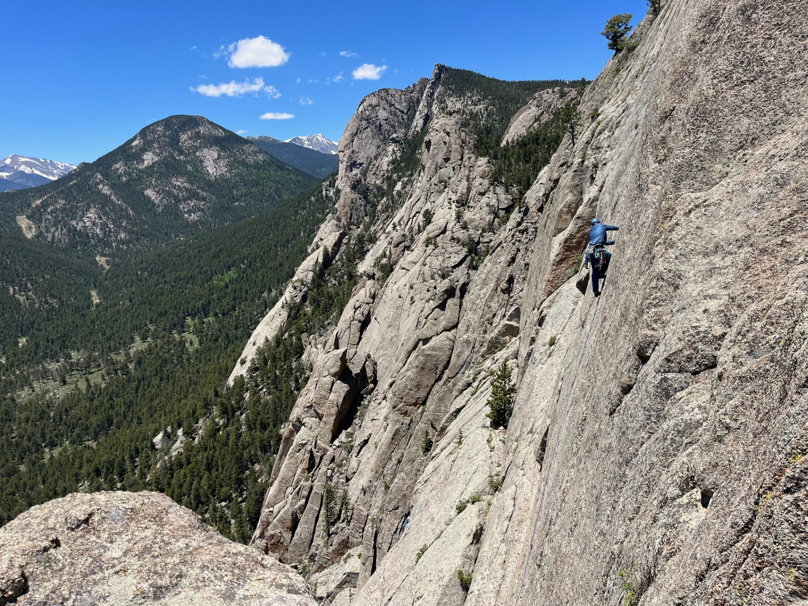

# Name: Taran Renfrow (he/him)

> Add your name and preferred pronouns in the heading above.

# 1. Programming Experience

> What are the main programming languages (if any) that you currently use and what is your approximate level of mastery? Don't worry if you don't have much programming experience yet! This just helps me understand everyone's background and plan accordingly.

-   Python. Beginner. 

::: callout-note
## Levels

-   beginner = know my way around the language enough to write some basic code
-   intermediate = know a few tricks and can usually figure out how to solve a problem using language help/online resources
-   advanced = can write code fluently without needing to stop for help and am generally aware of the language's best practices
-   expert = understand how the language is structured at a fundamental level and have a very intuitive understanding for efficiently solving any problem I encounter
:::

# 2. Course Goals

> List three goals you would like to accomplish through this class. This can be anything from things you'd like to know, skills you'd like to learn or improve, concepts you'd like to understand or apply, etc.

1.  I would like to become more familiar with coding as a whole, so that when I am tasked with something, I can form a competent road map to get me to the solution.

2.  I'd like to learn how to better customize my data presentations so that they're exactly how I want them.

3.  I want to expand my coding languages, since it seems like each language has different case-uses.  

# 3. Favorite equation

> Tell & show us one of your favorite equations to practice some LaTeX math. It does not have to be a complicated one. Have fun with it.

One of my favorite equations is the p-wave velocity equation: $V_p = \sqrt{\frac{K+\frac{4}{3}\mu}{\rho}}$. See @eq-fav

$$
V_p = \sqrt{\frac{K+\frac{4}{3}\mu}{\rho}}
$$ {#eq-fav}



# 4. A fatalistic flow chart

> Draw a little flowchart to practice this charting feature. It does not have to be complicated. Have fun with it. Don't forget to fill in a figure caption under `fig-cap`.

@fig-chart shows my favorite flow chart.

```{mermaid}
%%| label: fig-chart
%%| fig-cap: flow chart to determine what to eat.
graph TD
    A{Are you hungry?} -->|No| B(Wait a little while)
    A --> |Yes| C[Find some food]
    B --> C
    C --> A
```

::: callout-tip
Click on the "Preview" button above the code block to render your chart or use the [Mermaid Live Editor](https://mermaid.live/edit) if you want to see the output immediately.
:::

# 5. Something fun

> Add a picture of yourself doing something you enjoy outside school (hiking, cooking, playing music, reading, etc) to the `images` folder and link to it here with a descriptive caption by changing the `fix-cap` below. Make sure that images are not too big and in **jpeg/jpg** or **png** format. A width of 600 to maximally 1200 pixels is typically plenty large (i.e. less than **\~2Mb**). You can scale your image to these dimensions using any photo editing software. For example, a convenient free online tool for scaling images is available at <http://www.simpleimageresizer.com/>. Lastly, the file names are case-sensitive! So `example.PNG` (upper-case PNG) is not the same as `example.png` (lower-case png), make sure that you have the filename correctly.

@fig-fun demonstrates that I like climbing.

```{r}
#| label: fig-fun
#| fig-cap: I like climbing outside.
#| echo: FALSE
#| out-width: 100%

```