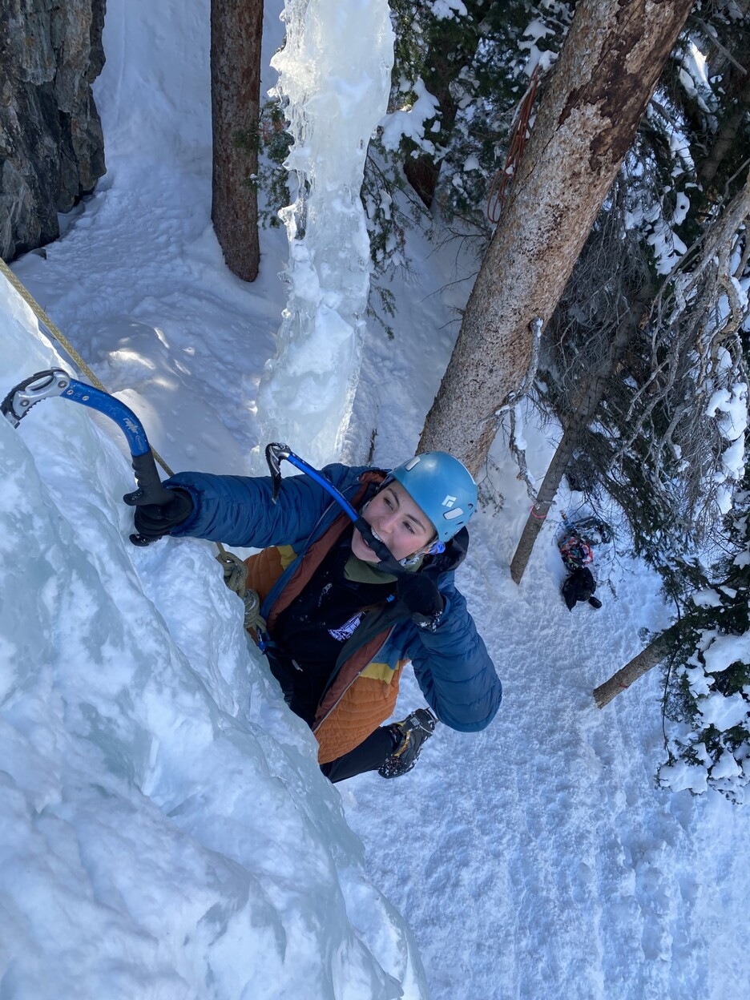

# Name: Anya Keena (She/her)


# 1. Programming Experience

-   Python (beginnert)

-   Linux? (beginner)

::: callout-note
## Levels

-   beginner = know my way around the language enough to write some basic code
-   intermediate = know a few tricks and can usually figure out how to solve a problem using language help/online resources
-   advanced = can write code fluently without needing to stop for help and am generally aware of the language's best practices
-   expert = understand how the language is structured at a fundamental level and have a very intuitive understanding for efficiently solving any problem I encounter
:::

# 2. Course Goals

1.  I use excel for every dataset I work with which is limiting and annoying. I want to be able to work with datasets within a code language where I can have more control of how they are represented. 

2.  I got my mass spectromemter data in R code and Ashley went through it with me so I could understand what I was looking at but I would like to know more about what went into that.

3.  I have a future in geobiology/geochemistry research and I know coding is fudemental for how data is intrepted, manipulated, modeled, and exported in figures and I want to be able to access this world. 

# 3. Favorite equation

@eq-fav is Stefan-Boltzmann's Law  ($P = e \sigma A T^4$), which is power = emissivity *  Stafan-Boltzmann's constant * temperature^4 * surface area and is used to calculate the amount of power that a surface radiates. 
$$
P = e \sigma A T^4
$${#eq-fav}
$$
\sigma = 5.67 * 10^{-18} J/s m^2 K^4
$$



# 4. Favorite flow chart

@fig-chart shows what my ideal work flow chart would look like. Behind the desk at the student climbing gym I work at in the student rec center we have a flow chart that shows what empoloyees should be doing. My boss loves to come up to us when we are socializing and ask where chatting is on the flow chart, so if it was up to me this is what the flow chart would look like. 

```{mermaid}
%%| label: fig-chart
%%| fig-cap: flowchart to help employees figure out what they should be doing at the climbing gym.
graph TB
    A((Is there a patron <br> at the climbing gym desk?)) -->|Yes| B(Help them out.)
    A --> |No| C(Talk to your coworker.)
    B --> C
```

::: callout-tip
Click on the "Preview" button above the code block to render your chart or use the [Mermaid Live Editor](https://mermaid.live/edit) if you want to see the output immediately.
:::

# 5. Something fun

@fig-fun shows how much fun I'm having.

```{r}
#| label: fig-fun
#| fig-cap: Me doing my favorite winter sport.
#| echo: FALSE
#| out-width: 100%

```
