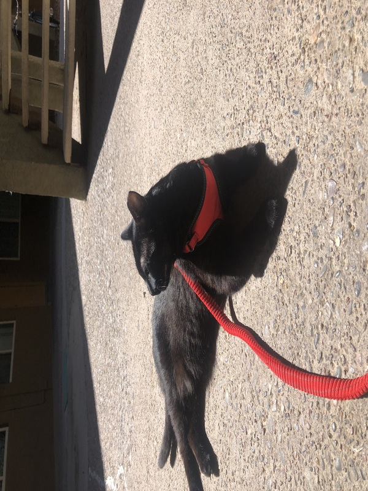

# Name: Alana Robinson (she/her)


# 1. Programming Experience


-   R (intermediate)

-   Pythin (beginner)

::: callout-note
## Levels

-   beginner = know my way around the language enough to write some basic code
-   intermediate = know a few tricks and can usually figure out how to solve a problem using language help/online resources
-   advanced = can write code fluently without needing to stop for help and am generally aware of the language's best practices
-   expert = understand how the language is structured at a fundamental level and have a very intuitive understanding for efficiently solving any problem I encounter
:::

# 2. Course Goals


1.  Improve my fluency in R

2.  Learn more tricks and tools for making a variety of plots

3.  Get more comfortable with surrounding coding tools (git, markdown, etc...)

# 3. Favorite equation

> Tell & show us one of your favorite equations to practice some LaTeX math. It does not have to be a complicated one. Have fun with it.

@eq-fav is the equation for calculating dilutions ($C1V1 = C2V2$). It's my favorite equation because its simple, versatile, and useful in day to day lab life.

$$
C1\cdot V1 = C2\cdot V2
$${#eq-fav}



# 4. Favorite flow chart
 

@fig-chart shows my favorite flow chart.

```{mermaid}
%%| label: fig-chart
%%| fig-cap: Important flowchart to figure out whether you can and should buy a fancy coffee.
graph LR
    A[Should I <br> buy that fancy coffee?] -.-> B((Am I tired?))
    A[Should I <br> buy that fancy coffee?] -.-> C((Do I have <br> lots of work to do?))
    A[Should I <br> buy that fancy coffee?] -.-> D((Do I need <br> a little treat?))
    B --> E{Do I have money?}
    C --> E
    D --> E
    E ==> |No| F(Cry ㅠ﹏ㅠ)
    E ==> |Yes| G(Coffeeee!!  ˶ˆᗜˆ˵ )
```

::: callout-tip
Click on the "Preview" button above the code block to render your chart or use the [Mermaid Live Editor](https://mermaid.live/edit) if you want to see the output immediately.
:::

# 5. Something fun

> Add a picture of yourself doing something you enjoy outside school (hiking, cooking, playing music, reading, etc) to the `images` folder and link to it here with a descriptive caption by changing the `fix-cap` below. Make sure that images are not too big and in **jpeg/jpg** or **png** format. A width of 600 to maximally 1200 pixels is typically plenty large (i.e. less than **\~2Mb**). You can scale your image to these dimensions using any photo editing software. For example, a convenient free online tool for scaling images is available at <http://www.simpleimageresizer.com/>. Lastly, the file names are case-sensitive! So `example.PNG` (upper-case PNG) is not the same as `example.png` (lower-case png), make sure that you have the filename correctly.

@fig-fun shows me having fun walking/sitting with my cat.

```{r}
#| label: fig-fun
#| fig-cap: Chilling in the sun with Lazarus.
#| echo: FALSE
#| out-width: 100%

```

