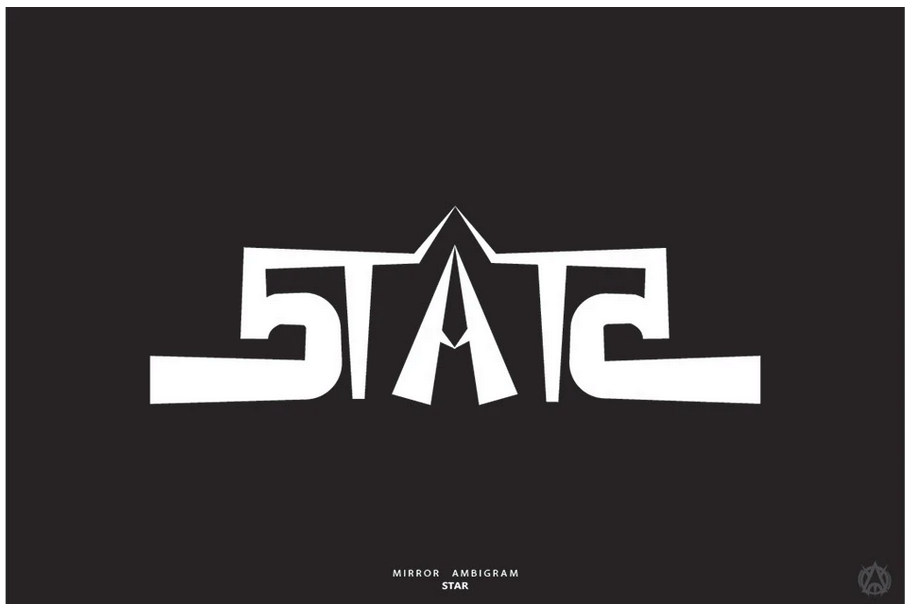

# Name: Ayon Saha (He/Him)


# 1. Programming Experience

-   MATLAB (intermediate)

-   Python (beginner)


# 2. Course Goals

1.  Imporove my ability to create clear and effective visualizations for my research in R.

2.  Become more comfortable with coding.

3.  Use visualizations to better communicate research results.

# 3. Favorite equation

One of my favorite equation is Darcy's law (@eq-darcy) that describes the groundwater flow through porus media.
$$
Q = -K A \frac{dh}{dl}
$$ {#eq-darcy}



# 4. Favorite flow chart

 
@fig-chart shows my decision process for determining whether I am sleepy.
```{mermaid}
%%| label: fig-chart
%%| fig-cap: A simple flowchart for deciding if you are sleepy.
graph LR
     A{Are you sleepy?} -->|Yes| B[Drink a coffee ]
  A -->|No| C{Yawning?}
  C -->|Yes| B
  B --> D{Still sleepy?}
  D -->|Yes| E[Go to sleep]

```

# 5. Something fun

I enjoy creating ambigrams - words which can be read the same from different angles.

```{r}
#| label: fig-fun
#| fig-cap: Mirror ambigram of ‘STAR’
#| echo: FALSE
#| out-width: 100%

```
