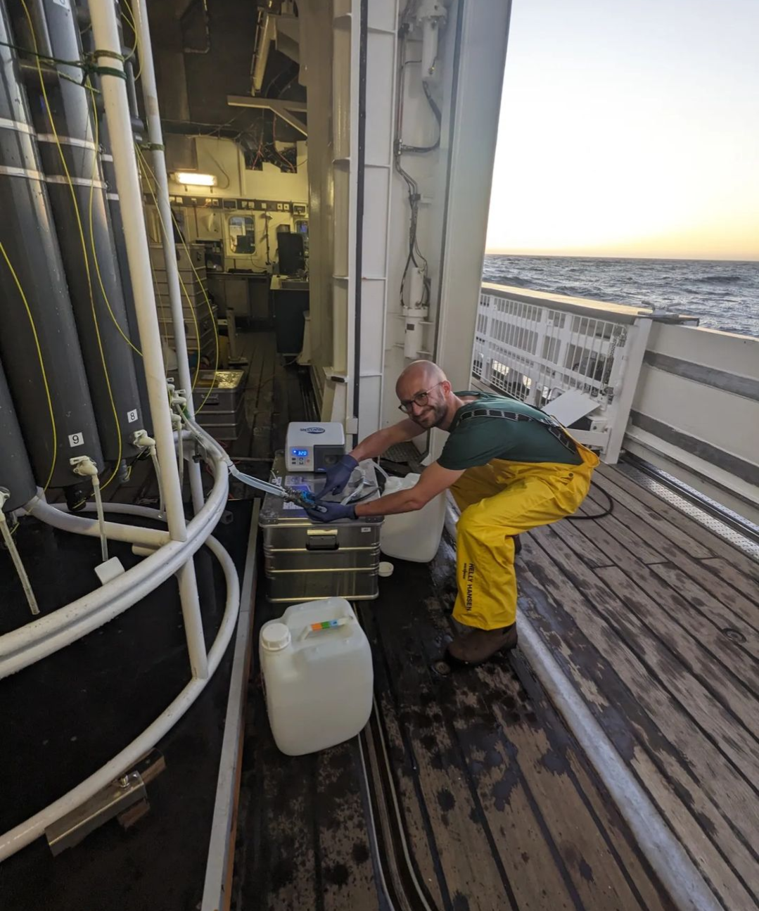

# Name: Harry Allbrook (he/him/his)

# 1. Programming Experience

> What are the main programming languages (if any) that you currently use and what is your approximate level of mastery? Don't worry if you don't have much programming experience yet! This just helps me understand everyone's background and plan accordingly.

-   R (intermediate/advanced) - I feel aware of best practices... trying to make good habits of them!

-   matlab/python (beginner) - played around with each of these a while ago, things have likely moved forward since and would need to refresh

::: callout-note
## Levels

-   beginner = know my way around the language enough to write some basic code
-   intermediate = know a few tricks and can usually figure out how to solve a problem using language help/online resources
-   advanced = can write code fluently without needing to stop for help and am generally aware of the language's best practices
-   expert = understand how the language is structured at a fundamental level and have a very intuitive understanding for efficiently solving any problem I encounter
:::

# 2. Course Goals

1.  Learn to collaborate more effectively with Github

2.  Document work with comments (neatly) on Github for smooth publishing process

3.  Wrangle and plot new data collected for thesis work

# 3. Favorite equation

@eq-fav is the Boltzmann equation ($S = k_{B}\ln \Omega$), which describes Entropy ($S$) of a system with ($\Omega$, @eq-W) possible configurations, or microstates, of a system.

$$
S = k_{B}\ln (\Omega) 
$${#eq-fav}

$$
\Omega = \frac{N!}{n_{1}!n_{2}!n_{3}!...}
$${#eq-W}



# 4. Favorite flow chart

@fig-chart shows a funky and vibrant flow chart.

```{mermaid}
%%| label: fig-chart
%%| fig-cap: Flowchart showing what to do with a sample.

graph TD
    A{Collect sample<br/> filter} --> B(Are you going to<br/> extract it today?) 
    B --> |Yes| C[Add standard and<br/> extract sample]
    B --> |No| D{Put sample in<br/> freezer for storage}
    C --> E{Put extract<br/> in freezer}

%% Control individual box colors
    %% Syntax: style [NodeID] fill:[color],stroke:[color],stroke-width:[px]
    style A fill:#a2a,color:#9f9,stroke:#9f9,stroke-width:5
    %%style B
    style C fill:#bbf,color:#111,stroke:#921,stroke-width:4
    style D fill:#f96,color:#145,stroke:#888,stroke-width:10
    style E fill:#b96,color:#123, stroke:#123,stroke-width:10

```

::: callout-tip
Click on the "Preview" button above the code block to render your chart or use the [Mermaid Live Editor](https://mermaid.live/edit) if you want to see the output immediately.
:::

# 5. Something fun


@fig-fun shows me sampling water on a research boat.

```{r}
#| label: fig-fun
#| fig-cap: Grown man in pants brighter than the sun collecting water from a niskin bottle of a CTD.
#| echo: FALSE
#| out-width: 100%

```
