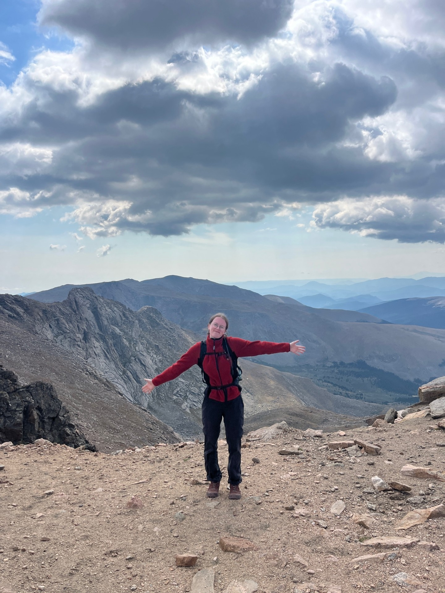

# Name: Paige (she/her)

# 1. Programming Experience

-  Python (beginner) - learning this right now!

-  C++ (intermediate) - learned in high school, haven't use it much since then

- Javascript (beginner) - also learned in high school but to a lesser extent & haven't used it much either

::: callout-note
## Levels

-   beginner = know my way around the language enough to write some basic code
-   intermediate = know a few tricks and can usually figure out how to solve a problem using language help/online resources
-   advanced = can write code fluently without needing to stop for help and am generally aware of the language's best practices
-   expert = understand how the language is structured at a fundamental level and have a very intuitive understanding for efficiently solving any problem I encounter
:::

# 2. Course Goals

1.  Becoming comfortable with programming languages again

2.  Learning how to represent data is an efficent manner

3.  Understanding the connection between R, Positron, and GitHub

# 3. Favorite equation

@eq-fav is the rate of decay equation ($-\frac{dN}{dt} = \lambda N$), one of my favorite equations in the whole wide world.

$$
-\frac{dN}{dt} = \lambda N
$${#eq-fav}



# 4. Favorite flow chart


@fig-chart shows my favorite flow chart.

```{mermaid}
%%| label: fig-chart
%%| fig-cap: Work planning flowchart to increase productivity.
graph TB
    A{Do you need <br> coffee?} -->|No| B(Do you have work to do?)
    A --> |Yes| C((Get a coffee!))
    B --> |No| D[Yes you do.]
    B --> |Yes| C
    D --> C
```

::: callout-tip
Click on the "Preview" button above the code block to render your chart or use the [Mermaid Live Editor](https://mermaid.live/edit) if you want to see the output immediately.
:::

# 5. Something fun

@fig-fun shows how much fun I'm having.

```{r}
#| label: fig-fun
#| fig-cap: Just before the last scramble of Mt. Bierstadt!
#| echo: FALSE
#| out-width: 75%

```
