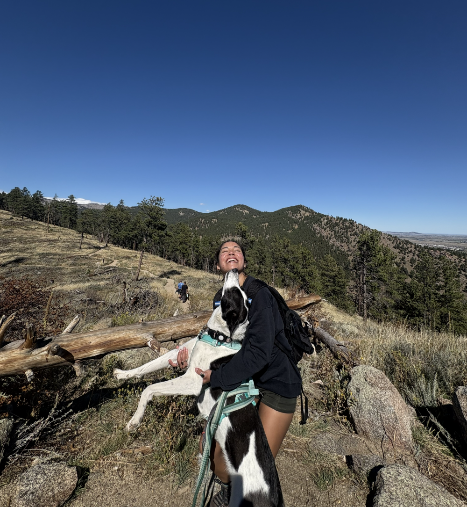

# Angie Stefannia Tasayco: (she/her)

# 1. Programming Experience

-   R (intermediate)

-   NA

::: callout-note
## Levels

-   beginner = know my way around the language enough to write some basic code
-   intermediate = know a few tricks and can usually figure out how to solve a problem using language help/online resources
-   advanced = can write code fluently without needing to stop for help and am generally aware of the language's best practices
-   expert = understand how the language is structured at a fundamental level and have a very intuitive understanding for efficiently solving any problem I encounter
:::

# 2. Course Goals

1.  I would like to imrpove my data interpretation and anaylsis skills.

2.  I would like to become profficient in R and GitHub to complement my PhD presentations.

3.  I want to be very organized with data management. 

# 3. Favorite equation

> Tell & show us one of your favorite equations to practice some LaTeX math. It does not have to be a complicated one. Have fun with it.

@eq-fav, the quadratic formula, is one of my favorite equations in the whole wide world because of its fun jingle.

$$
x = \frac{-b\pm\sqrt{b^2-4ac}}{2a}
$${#eq-fav}



# 4. Favorite flow chart 

@fig-chart shows my favorite flow chart.

```{mermaid}
%%| label: fig-chart
%%| fig-cap: Cat lovers flowchart to figure out whether you should adopt a cat.
graph 
    A{Do you own <br> a cat?} -->|No| B(Why not?)
    A --> |Yes| C[Adopt <br> another cat!]
    B --> |Allergies| D[Get a <br> Sphynx!]
    B --> |I don't <br> like cats| E[Give them <br> a chance!]

```

::: callout-tip
Click on the "Preview" button above the code block to render your chart or use the [Mermaid Live Editor](https://mermaid.live/edit) if you want to see the output immediately.
:::

# 5. Something fun

@fig-fun shows how much fun I'm having.

```{r}
#| label: fig-fun
#| fig-cap: Me and my friends' dog at the top of my favorite hike in Boulder.
#| echo: FALSE
#| out-width: 100%

```
